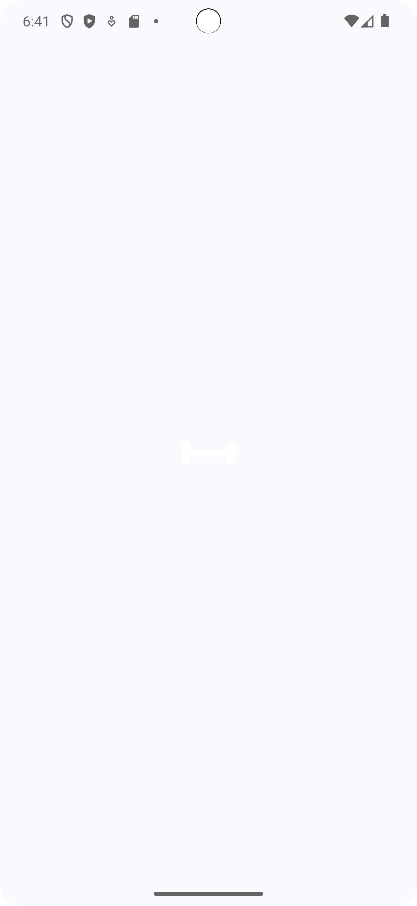
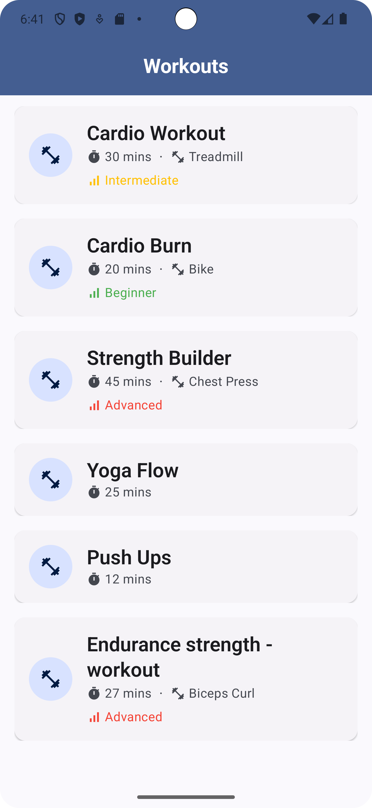
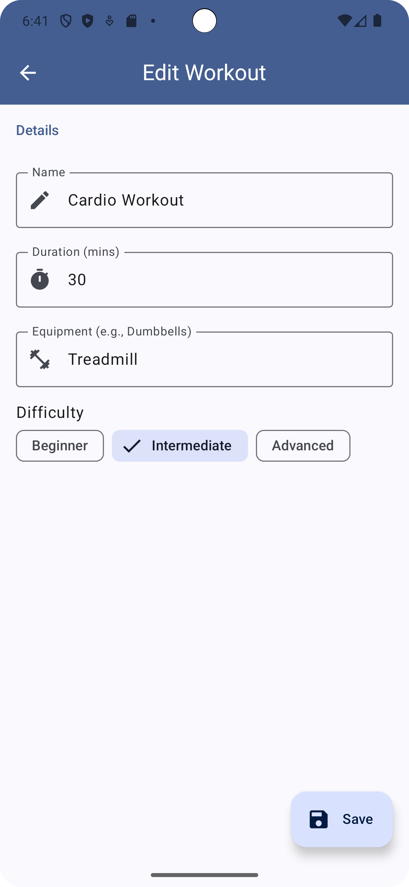
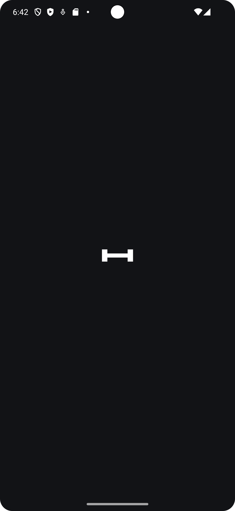
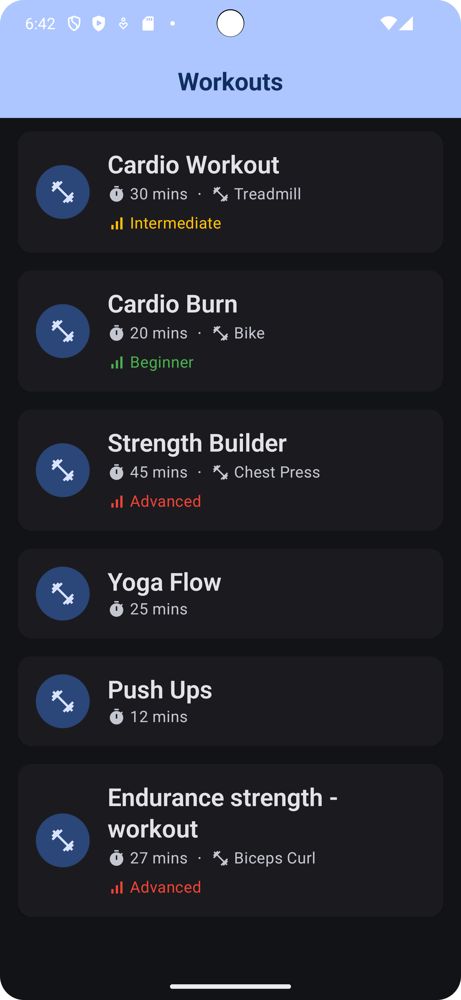
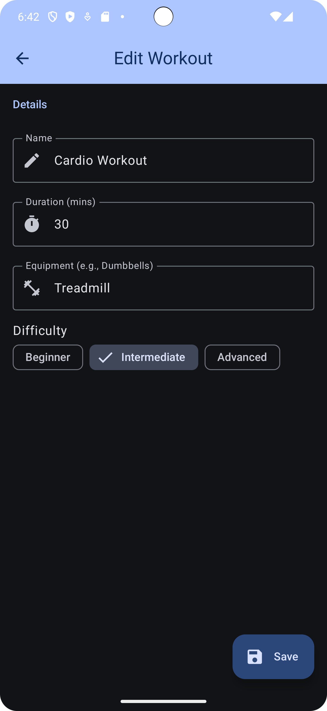

<p align="center">

<h1 align="center">❚█══█❚  Workouts - Johnson Health Tech  ❚█══█❚</h1>
<p align="center">
Explore a variety of workouts at your fingertips!
</p>
</p>

Workouts is an app designed for fitness enthusiasts who enjoy exploring new workout routines. Whether you're looking for a beginner, intermediate, or advanced workout, this app has got you covered.


[](https://www.linkedin.com/in/timothysliu/)
[](mailto:timo9036@hotmail.com)

## Table of Contents

1. [Screenshots](#-screenshots)
2. [Developer's Notes](#-developer-notes)
3. [Features](#-features)
4. [Built With](#-built-with)
5. [Architecture](#️-architecture)
6. [Package Structure](#-package-structure)

---

## 📸 Screenshots

Explore the app through these stunning visuals!

<table>
  <tr>
     <th>Light Splash Page</th>
     <th>Light List Page</th>
     <th>Light Details Page</th>
  </tr>

  <tr>
    <td>
        
    </td>
    <td>
        
    </td>
    <td>
        
    </td>

  </tr>

</table>

<table>
  <tr>
    <th>Dark Splash Page</th>
<th>Dark List Page</th>
<th>Dark Details Page</th>
  </tr>
  <tr>
    <td>

    </td>
<td>

    </td>
<td>

    </td>
  </tr>
</table>

## 📝 Developer Notes
---
### What did you focus on and why?

My primary focus was on two key areas: building a scalable architecture and creating a polished, responsive user interface.

For the architecture, I chose an MVVM (Model-View-ViewModel) approach that's geared for growth.

I set up the Difficulty as an Enum class, which makes it simple to add new levels like "Rehabilitation" later on. The repository pattern, with WorkoutRepository and WorkoutRepositoryImpl, is in place so that switching from local data to a live API with Retrofit would be a seamless transition.

The app uses a Room database as the single source of truth, ensuring that the UI displays consistent and reliable data.

The Json file provided is in an incorrect format, but I've used Gson to "clean" the Json strings as it is my responsibility to my app robust, applying defensive programming methodology.

On the UI side, I used Jetpack Compose to create a modern and flexible interface.

I used a sealed class, UiState, to manage different screen states like loading, success, and error, which makes the user experience much smoother.

Small details were important. For example, the top app bar on the workout list screen has a nice scroll behavior. The list items themselves are designed to handle workouts that might be missing certain details, like equipment or difficulty, without breaking the layout.

On the detail screen, I used rememberSaveable for the input fields. This ensures that if a user rotates their screen or a configuration change happens, they won't lose any of the data they've entered.

The colors and themes follows the Material 3 Designs that allows for light and Dark mode.


### What would you improve with more time?

I've left no stones unturned for this project as I feel a connection to the firm due to us both having Taiwanese roots and I've actually seen the "Qiao Shan" massage chairs in the malls of Taiwan when I last traveled there.

If I had more time, I will work on expanding the application. The next logical step would be to transition the data source from the local JSON file to a live API using Retrofit. Following that, an "Add" Button to add a new list to the main page, a "Favorites" list for workouts and a bottom navigation bar to make moving around the app even easier, and more.

### How did you approach testing?
My approach included unit, integration, and UI tests to ensure the app is robust.

Unit Tests: I wrote unit tests to verify the individual components of the app. This includes tests like ConvertersTest to ensure data is correctly converted for the database, InitialDataTest to confirm that the initial JSON data is parsed correctly, and tests for the ViewModels using a mock repository to isolate the business logic.

Integration Tests: To ensure the database layer works as expected, I wrote integration tests for the WorkoutDao. These tests verify that all the database operations—like inserting, querying, and updating workouts—function correctly.

UI Tests: Finally, to confirm that the user experience is solid, I created UI tests. These tests simulate user interaction to make sure that screens display the right data and that the app gracefully survives configuration changes, like screen rotations, without losing its state.


---
## 🌟 Features

- **Explore Workouts:** Browse through a vast collection of workouts.
- **Workout Details:** Get detailed information for each workout including duration, equipment, and difficulty.
- **Edit Workouts:** Modify workout details such as name, duration, and equipment.
- **Difficulty Selector:** Filter workouts by difficulty level.
- **Splash Screen:** A visually appealing entry point to the application.
- **Light and Dark mode:** Light and Dark mode with Material Design 3.
- **Testing:** Unit, Integration, and Ui Testing.

## 🛠 Built With

<p align="center">
Explore the technology stack that powers Workouts - the app for fitness enthusiasts!
</p>

- [Kotlin](https://kotlinlang.org/) - First class and official programming language for Android development.
- [Jetpack Compose](https://developer.android.com/jetpack/compose) - Android’s modern toolkit for building native UI.
- [Coroutines](https://kotlinlang.org/docs/reference/coroutines-overview.html) - For asynchronous programming.
- [Flow](https://kotlin.github.io/kotlinx.coroutines/kotlinx-coroutines-core/kotlinx.coroutines.flow/-flow/) - A cold asynchronous data stream that sequentially emits values and completes normally or with an exception.
- [Android Architecture Components](https://developer.android.com/topic/libraries/architecture) - Collection of libraries that help you design robust, testable, and maintainable apps.
- [ViewModel](https://developer.android.com/topic/libraries/architecture/viewmodel) - Stores UI-related data that isn't destroyed on UI changes.
- [Room](https://developer.android.com/topic/libraries/architecture/room) - SQLite object mapping library.
- [Navigation Component](https://developer.android.com/guide/navigation/navigation-getting-started) - Helps you implement navigation, from simple button clicks to more complex patterns.
- [Hilt-Dagger](https://dagger.dev/hilt/) - Standard library to incorporate Dagger dependency injection into an Android application.
- [Gson](https://github.com/google/gson) - A Java library that can be used to convert Java Objects into their JSON representation.
- [Material Components for Android](https://github.com/material-components/material-components-android) - Modular and customizable Material Design UI components for Android.
- [Gradle Kotlin DSL](https://docs.gradle.org/current/userguide/kotlin_dsl.html) - For writing Gradle build scripts using Kotlin.

## 🏛️ Architecture

This app is based on the [***MVVM (Model View View-Model)***](https://developer.android.com/jetpack/docs/guide#recommended-app-arch) architecture and repository pattern.


## 📦 Package Structure
```   
    🌐com.example.workouts_johnsonhealthtech   # Root Package
    .
    ├── 📁data                # Focused on data handling, manipulation, and retrieval
    │   ├── 📚local           # Pertains to local persistence database, primarily using Room (SQLite)
    |   │   ├── 🔑dao         # Data Access Object(s) for Room to interact with the database 
    │   └── 📚repository      # Acts as a single source of truth for all data
    |
    ├── 💉di                  # Dependency Injection (DI) related classes           
    |
    ├── 👤model               # Defines the data models used within the app
    |
    ├── 🖼️ui                  # User Interface layer containing views and their related logic
    │   ├── 📱detail      # Contains the detail screen and its corresponding ViewModel
    │   ├── 🧭navigation      # Houses the navigation logic for the app
    │   ├── 🚀splash          # Contains the splash screen
    │   ├──🎨theme            # Defines the app's theme and colors
    │   └── 🏋️workouts         # Contains the workout list screen and its ViewModel
    |
    └── 🧠viewmodels          # ViewModel classes responsible for preparing and managing the data for UI components
```
---
# Workout List App - Coding Assignment

## Overview

Welcome! This assignment is designed to evaluate your Android development skills, including your ability to work with JSON data, build clean UI, implement user interactions, and write testable, maintainable code.

You'll build an Android app that reads a local JSON file and displays a list of workouts. Users should be able to edit workout details.
You'll have one week to complete this assignment. While we understand everyone works at their own pace, we recommend spending no more than 4–6 hours on it. We’re not looking for a fully polished or production-ready app.  So, focus on clean, understandable code and demonstrating your thought process.

---

## ✨ Requirements

### Core Functionality

1. **Load & Display Workouts**
   - Load the provided JSON file (`workouts.json`).
   - Display the list of workouts in a scrollable list.

2. **Edit Workouts**
   - Users should be able to tap on a workout to view and edit its details in a separate screen.
   - Changes should be retained in-memory during the session.
---

## 🛠 Technical Expectations

- Use **Kotlin** or **Java** as the base language.
- Use **Jetpack Compose** or **XML** for UI.
- Add **unit tests** and/or **UI tests** to validate core functionality.

---

## 🎯 Bonus Points

- Persist workout changes.
- Deliver a polished and responsive UI.
- Scalable code structure.

---

## 🧪 Testing

Please include tests for:
- JSON parsing and data modeling
- Core logic (e.g., editing and updating workout details)
- UI interaction (if applicable)

---

## 📝 Developer Notes

Please fill out the section below before submitting your solution.

### What did you focus on and why?

### What would you improve with more time?

### How did you approach testing?

---

## 📁 Provided Files

- `workouts.json`
- `README.md`

---

## 🚀 Submission Instructions

1. Complete the assignment and update this `README.md` with your responses above.
2. Upload your project to a private GitHub repository or share it via a zip file.
3. Make sure your project builds and runs cleanly.

Have fun building! 💪


